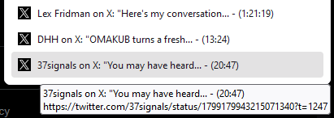

# x.com/Twitter Video Bookmarker
Create a bookmark of an x.com video post at the current play time with one click.

## Installation
In Firefox go to `Add-ons and themes`, search for the extension in the search field `Find more add-ons` or directly go to the extension [page](https://addons.mozilla.org/en-US/firefox/addon/x-com-twitter-video-bookmarker/). Then press `Add to Firefox`.

To add the extension to the Toolbar, click on the `Extensions` icon on the toolbar, click on the cogwheel icon for the extension and select `Pin to Toolbar`.

## Features
When you click on the extension icon, a timestamped bookmark is automatically created in the Bookmarks Toolbar.

## Usage
For the extension to work correctly, the video post needs to be opened in the current tab. The url of these posts is `https://x.com/<user>/status/<post_number>`.

- To save a bookmark, click on the extension icon while the video is paused or playing
- To continue watching from the timestamp, click on the created bookmark link, click on the video to un-mute

## License
[Mozilla Public License 2.0 (MPL 2.0)](https://www.mozilla.org/en-US/MPL/2.0/)
